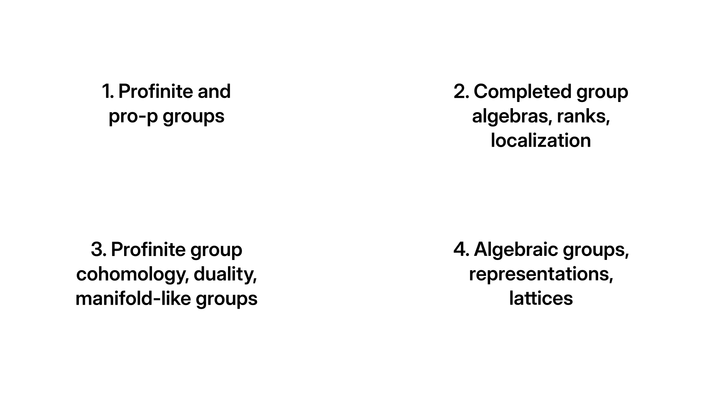

## Research map

{width=92% fig-align="center"}

## Early independence: Demushkin groups

**Solo paper, J. Group Theory, 2022, 11 p.**

- Retracts of Demushkin groups
- Pro-$p$ analogue of phenomena for surface groups
- New methods: the surface proof does not carry over.

## Main pillar I: completed group algebras

**With A. Jaikin-Zapirain, Documenta Math. 2025, 50 p.**

Ring-theoretic properties of $\mathbb F_p[\![G]\!]$ for $G$ virtually free-by-$\mathbb Z_p$.

Main themes:

- Sylvester rank functions
- Noncommutative localization
- Filtered/graded methods
- Approximation by finite quotients

## My contribution to this line

- Structural analysis of virtually free-by-$\mathbb Z_p$ pro-$p$ groups
- Graded algebra as an Ore extension of a free algebra
- Topological viewpoint on localization of profinite rings
- Development of rank functions as a core technical tool

**Thesis synthesis:** examples, conjectures, and future directions beyond the paper.

## Main pillar II: asymptotics of rational representations

**With L. Guerrero-Sánchez, preprint, 33 p.**

Reinterprets the asymptotic behaviour of rational representations in terms of rank functions on group algebras.

Motivation:

- twisted cohomology
- approximation of $\ell^2$-Betti numbers
- non-arithmetic lattices in $\mathrm{SL}_2(\mathbb C)$
- higher-rank conjectures

## Broader pro-$p$ and profinite program

Further preprints:

- With P. Zalesskii: $\mathrm{PD}^2$ groups and pro-$p$ limit group analogues
- With P. Zalesskii and A. Jaikin-Zapirain: profinite rigidity of graphs of virtually free groups

Main technical themes:

- Pro-$p$ analogues of simple closed curves
- Translating profinite splitting data into discrete splitting data via derivations

## Current and future work

In preparation with A. Jaikin-Zapirain and N. Otmen:

- profinite $\mathrm{PD}^3$ groups
- non-large and non-analytic examples
- exponential torsion homology growth

Future direction:

- asymptotic cohomology of higher-rank lattices through completed universal enveloping algebras (w/ K. Ardakov)

## Fit and summary

My profile sits between:

- profinite group theory
- completed group rings and algebras
- cohomological methods
- representation theory

At UnB, I would contribute through:

- research at the intersection of groups and algebras
- international collaborations
- student training in profinite methods, rank functions, and noncommutative algebra